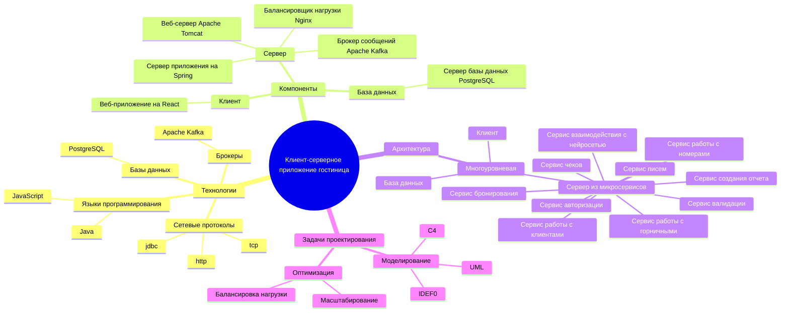
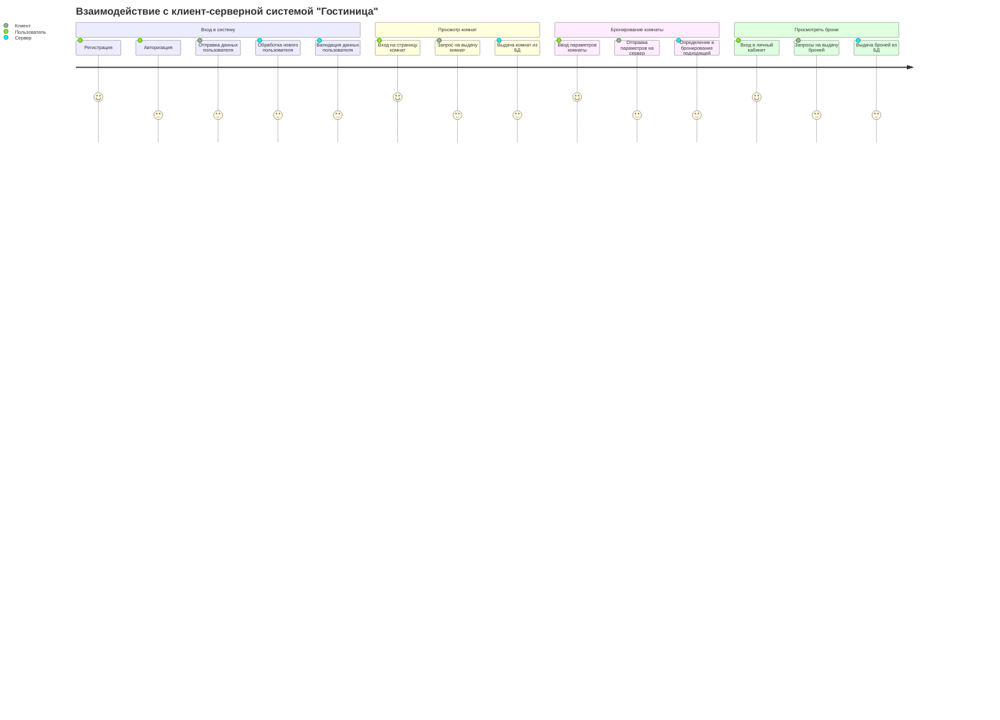
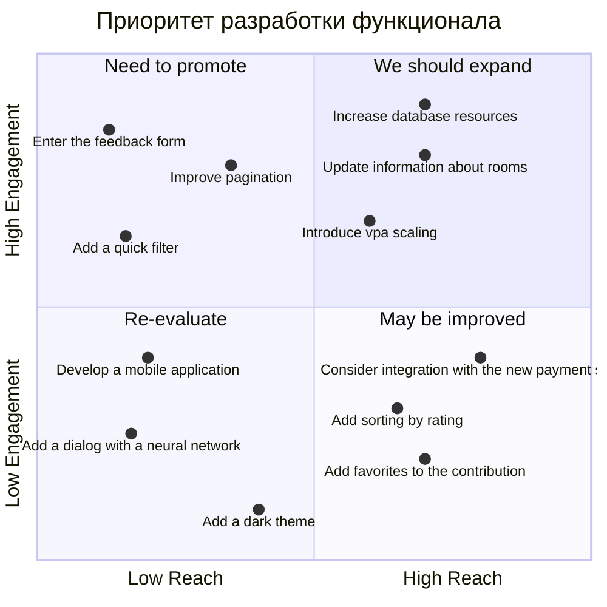
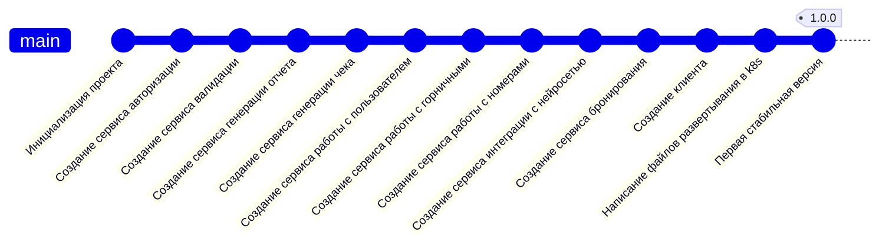

# Проектирование клиент-серверной системы "Гостиница"
## Структура функциональных возможностей

### Пояснение диаграммы
Данная диаграмма предназначена, чтобы структурировать и визуализировать информацию об устройстве клиент-серверной системы "Гостиница". На диаграмме указан стек, архитектура, компоненты и задачи проектирования данной системы.

1. Технологии: Сервер написан на языке Java, фреймворк Spring, клиент - написан на языке JavaScript, фреймворк React. В качестве базы данных используется реляционная база данных PostgreSQL, в качестве брокера сообщений - Apache Kafka. Общение между клиентом и сервером происходит по протоколу http, между сервером и брокером - по проколу tcp, между сервером и базой данных - по протоколу jdbc.
2. Компоненты: Клиент написан на языке JavaScript, React, и представляет из себя веб-приложение. Сервер написан на языке Java, Spring, состоит из встроеннго веб-сервера Apache Tomcat, сервера приложений Spring, брокера сообщений Apache Kafka и балансировщика нагрузки Nginx. База данных представляет собой реляционную базу данных PostgreSQL.
3. Архитектура: приложение используется трехуровневую архитектуру, разделяясь на клиент, сервер и базу данных. Сервер использует микросервисы. Сервис авторизации отвечает за регистрацию и вход пользователей, валидации - за валидирование запросов пользователей, бронирования - за бронирование комнат, работы с клиентами - за работу с клиентами, писем - за отправку писем горничным, нейросети - за взаимодействие с API нейросети, работы с горничными - за работу с горничными, работы с номерами - за работу с номера, отчетов - за создания отчетов о бронировании, чеков - за создании чека бронирования.
4. Задачи проектирования: При проектировании использовались различные диаграммы в нотациях C4, UML, IDEF0, IDEF3, DFD. Основные проблемы, решаемые при проектировании, - способы масштабироваться и балансировать нагрузку.

## Диаграмма путешествия пользователя 

### Пояснение диаграммы
Данная диаграмма предназначена, чтобы отобразить основные сценарии использования данной системы пользователем.
Сценарии использования:
1. Вход/регистрация: пользователь может войти в аккаунт, либо зарегистироваться, при этом клиент отправляет данные пользователя на сервер, а тот и обрабатывает, валидиурет или создает нового пользователя.
2. Просмотр комнат: пользователь может зайти на страницу комнат, чтобы просмотреть их характеристики, при этом клиент отправляет запрос о данных комнат, сервер берет эти данные из базы данных.
3. Бронирование комнаты: пользователь может забронировать комнату, он должен ввести необходимые параметры, клиент отправит их на сервер, а сервер в соотвествии с параметрами подберет и забронирует комнату.
4. Просмотр брони: пользователь может зайти в личный кабинет и посмотреть свои брони, клиент сделает за запрос за бронями на сервер, а тот возьмет их из базы данных.

## Квадрант-граф 

### Пояснение диаграммы
Данная диаграмма предназначена, чтобы расписать актуальные задачи над системой их приоритет.
1. Нужно немедленно реализовать VPA мастшабирование и увеличить ресурсы базы данных - поток пользователей повышается, необходимо повышать ресурсы. Также данные о комнатах поменялись, необходимо срочно обновить информацию на сервере.
2. Пользователи страдают от неудобной и медленной работы приложения: нужно в ближайшее время улучшить алгоритмы фильтрации и пагинации. Также в ближайшее время необходимо добавить форму обратной связи, чтобы знать мнение пользователей о системе.
3. Аналитики считают, что темная тема, мобильное приложение и чат с нейросетью не сильно увеличат внимание пользователей, поэтому эти задачи стоит отложить, или вообще отказаться от них.
4. Интеграция с новой платежной системой, добавление вкладки "избранное" и сортировка комнат по рейтингу требуют глубокой аналитики, прежде чем отправиться в стадию разработки.

## Гит граф 

### Пояснение диаграммы
Данная  диаграмма предназачена для наблюдения истории разработки проекта.
По ней видно, что сначала создалась серверная часть, затем клиентская, затем все было развернуто в k8s.
